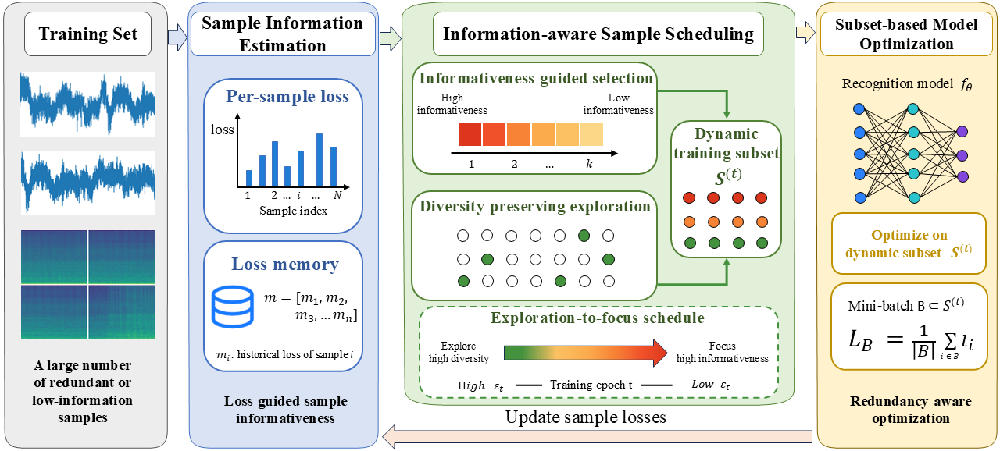

# Information-Aware Dynamic Sample Scheduling for Underwater Acoustic Target Recognition

This repository provides the implementation of an **Information-Aware Dynamic Sample Scheduling** framework for efficient underwater acoustic target recognition.

The main idea is to improve training sample utilization for densely segmented underwater acoustic recordings. Instead of using all segmented samples in every epoch, the proposed framework dynamically selects informative training samples according to model feedback, while retaining random exploration to preserve data coverage.

---

## Framework Overview

<p align="center">
  
</p>

<p align="center">
<b>Figure 1.</b> Overview of the proposed information-aware dynamic sample scheduling framework.
</p>

The framework consists of three major components:

### Sample Information Estimation

For each training sample, a lightweight **loss memory** is maintained to record the latest observed classification loss. The stored loss values are used as an estimate of sample informativeness. Samples with higher losses are considered potentially more valuable for subsequent optimization.

### Information-Aware Sample Scheduling

Based on the estimated informativeness, the training subset is dynamically reconstructed at the beginning of each epoch.

The selected subset consists of:

* **Informativeness-guided samples**, selected according to the loss memory.
* **Diversity-preserving exploration samples**, randomly sampled from the remaining data.

An **exploration-to-focus schedule** gradually shifts training from broad data coverage to informative sample emphasis.

### Subset-Based Model Optimization

The recognition model is optimized only on the selected dynamic subset.

After each epoch:

1. Sample losses are updated.
2. Loss memory is refreshed.
3. Informativeness scores are re-estimated.
4. A new subset is generated for the next epoch.

This forms a closed-loop optimization process that improves sample utilization while reducing redundant training on highly similar acoustic segments.

---

## Code Structure

```text
.
├── assets/
│   └── system_architecture.png
│
├── configs/
│   ├── resnet_wave.yaml
│   ├── resnet_mel.yaml
│   ├── convnext_wave.yaml
│   └── convnext_mel.yaml
│
├── datasets/
│   ├── deepship_dataset.py
│   ├── preprocessing.py
│   └── split_dataset.py
│
├── models/
│   ├── resnet.py
│   ├── convnext.py
│   └── build_model.py
│
├── schedulers/
│   ├── loss_memory.py
│   ├── dynamic_sampler.py
│   └── exploration_schedule.py
│
├── trainers/
│   ├── trainer_full.py
│   ├── trainer_random.py
│   └── trainer_dynamic.py
│
├── utils/
│   ├── metrics.py
│   ├── logger.py
│   ├── seed.py
│   └── checkpoint.py
│
├── train.py
├── evaluate.py
├── requirements.txt
└── README.md
```

Main Components
datasets/

This folder contains dataset loading and preprocessing scripts.

deepship_dataset.py: defines the dataset class for loading waveform or Mel-spectrogram samples.
preprocessing.py: performs audio resampling, segmentation, and feature extraction.
split_dataset.py: splits the original audio files into training, validation, and test sets at the file level.
models/

This folder contains recognition backbone networks.

resnet.py: implementation of ResNet-based recognition models.
convnext.py: implementation of ConvNeXt-based recognition models.
build_model.py: builds the selected model according to the configuration file.
schedulers/

This folder contains the core implementation of the proposed dynamic sample scheduling strategy.

loss_memory.py: maintains and updates the per-sample loss memory.
dynamic_sampler.py: constructs the dynamic training subset at each epoch.
exploration_schedule.py: controls the transition from exploration to focus during training.
trainers/

This folder contains different training strategies.

trainer_full.py: standard full-data training.
trainer_random.py: random subset training.
trainer_dynamic.py: proposed information-aware dynamic sample scheduling training.
utils/

This folder contains common utility functions.

metrics.py: computes classification accuracy and other evaluation metrics.
logger.py: records training logs.
seed.py: sets random seeds for reproducibility.
checkpoint.py: saves and loads model checkpoints.
Installation

Create a conda environment:

conda create -n dynamic-scheduling python=3.8
conda activate dynamic-scheduling

Install dependencies:

pip install -r requirements.txt
Data Preparation

The dataset should be organized by category:

DeepShip/
├── Cargo/
├── Passenger/
├── Tanker/
└── Tug/

Run preprocessing:

python datasets/preprocessing.py \
    --data_root /path/to/DeepShip \
    --save_root /path/to/processed_deepship \
    --sample_rate 16000 \
    --segment_length 3
Training
Full-data training
python train.py \
    --config configs/resnet_wave.yaml \
    --mode full \
    --data_root /path/to/processed_deepship
Random subset training
python train.py \
    --config configs/resnet_wave.yaml \
    --mode random \
    --retention_ratio 0.7 \
    --data_root /path/to/processed_deepship
Information-aware dynamic sample scheduling
python train.py \
    --config configs/resnet_wave.yaml \
    --mode dynamic \
    --retention_ratio 0.7 \
    --epsilon_max 1.0 \
    --epsilon_min 0.3333 \
    --data_root /path/to/processed_deepship
Evaluation
python evaluate.py \
    --checkpoint /path/to/checkpoint.pth \
    --data_root /path/to/processed_deepship \
    --input_type wave